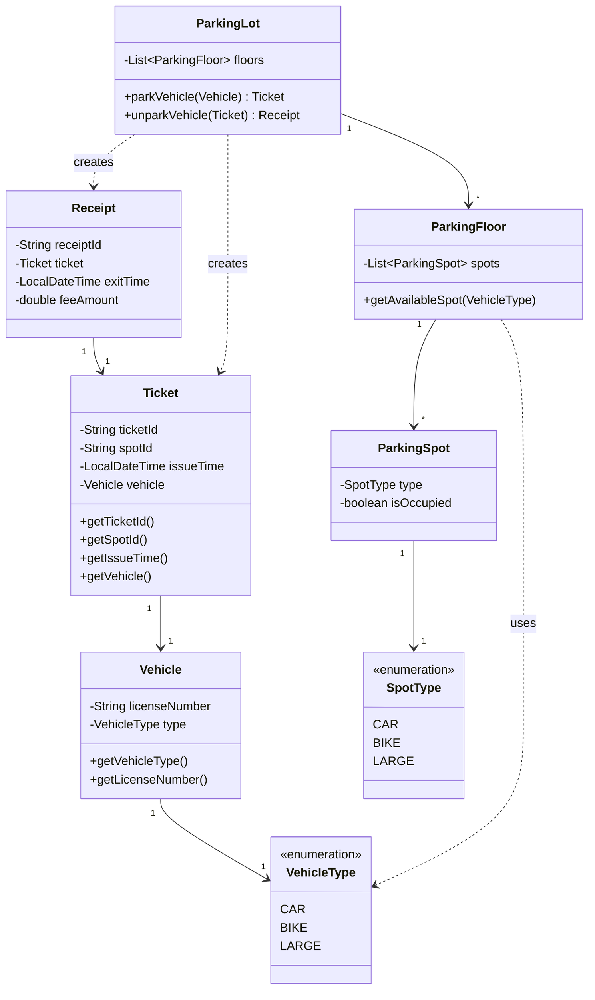
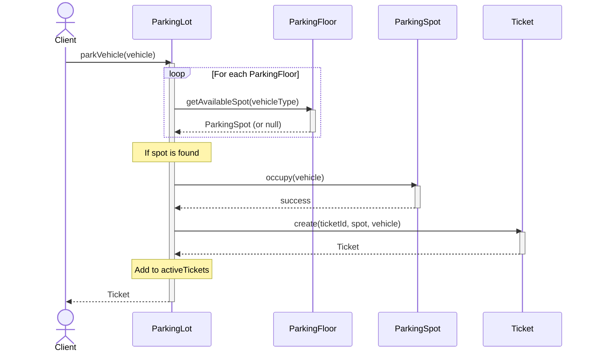
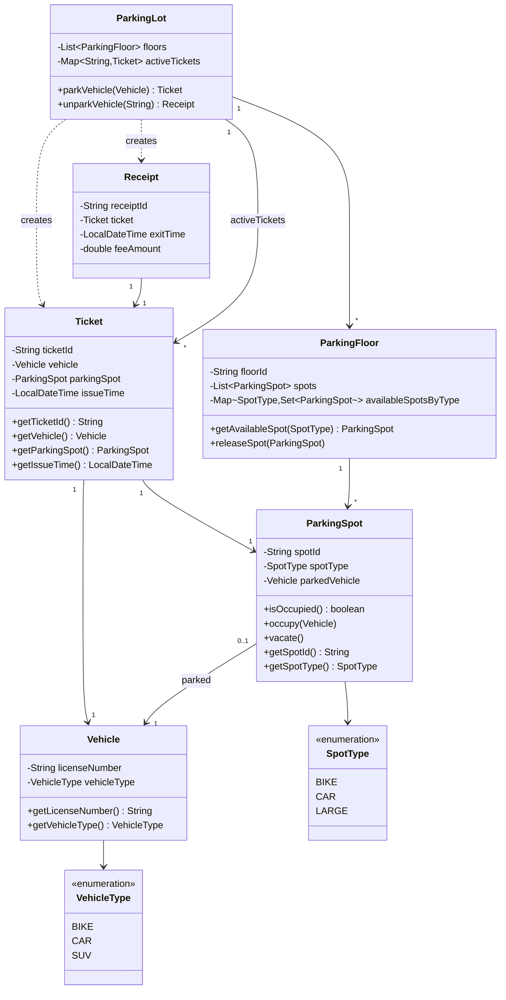

# Parking Lot System

## Requirement
- System support 3 types of vehicle - Car, SUV and Bike
- On Entry - system issues a ticket with ticket id and spot id
- On Exit - system validates the ticket and calculates the fee based on duration (time parked) 
- Pricing is hourly - always round off
- System reject entry if spot is not avilable
- System rejects exit if ticket is invalid
- Supports Multiple floors

## Out of scope 
- Payment processing
- Reservation/pre-booking
- Securty camera monitoring


## Assumption 
- single entry/exit point per floor
- fee calculated per hour 

## Approach
```
Phase 1 -> Basic entities - Parkinglot,ParkingFloor, ParkingSpot, Ticket

Phase 2 -> activeTickets, availableSpotsByType

Phase 3 -> ParkingStrategy
            (allocation rules vary)

Phase 4 -> PricingStrategy
            (pricing rules vary)
```
## Class Diagram

### Phase 1 - Basic object model
We will have
- Vehicle - vehicleType,licenseNumber
- ParkingLot - List~ParkingFloor~ floors
- ParkingFloor - List~ParkingSpot~ spots
- ParkingSpot - spotType, isOccupied, spotId
- Ticket - ticketId, spotId, issueTime, vehicle



### Entry Sequence Diagram



 ### Phase 2 : Perfomance Optimization
List of questions 
1. Let us try parkVehicle -> how would find a available spots ?
    * For each floor in parking lot ask floor to provide a parking spot -> mark it as occupied and return the ticket.
2. `ParkingFloor.getAvailableSpot(vehicleType)` -> Do you scan all the spots in the floor ?
    * We can maintain a `Map<SpotType,Set<ParkingSpot>>` availableSpots 
3. Follow up #2 , now in your ParkingSpot we have isOccupied and availableSpots , how to keep them consistent ?
    * need to introduce two method `ParkingSpot.vacate` and `ParkingSpot.occupy` 
    This will control that an unavailable spot is not set as occupied again 
    e.g. 
    ```java
    public void occupy(){
        if(isOccupied) throw new IllegalStateException("Spot Alreday Occupied");
        isOccupied = true;
        removeAvailable();
    }
    
    public void vacate(){
        if(!isOccupied) throw new IllegalStateException("Spot is already Vacant");
        isOccupied = false;
        addAvailable();        
    }
    ``` 
    
    Not only this tomorrow `ParkingSpot` can have more properties like currentVehicle, or occupiedSince 
    
    ```java
    class ParkingSpot{
        private boolean isOccupied;
        private Vehicle currentVehicle;
        private LocalDateTime occupiedSince;
        
        public void occupy(Vehicle vehicle){
            if(isOccupied) throw new IllegalStateException("Spot Alreday Occupied");
            isOccupied = true;
            currentVehicle = vehicle;
            occupiedSince = LocalDateTime.now();
            removeAvailable();
        }

        public void vacate(){
            if(!isOccupied) throw new IllegalStateException("Spot is already Vacant");
            isOccupied = false;
            currentVehicle = null;
            occupiedSince = null;
            addAvailable();
        }
    }
    ```

    Hence we need to use occupy/vacate api to control instead of exposing all getters/setters- making it extendible, otherwise each class would need to add more method calls alongside setOccupied like setCurrentVehicle, setOccupiedSince etc

    *We would still need both availableSpots and isOccupied as we would need*

 4. How would you find the spot to be freed when you `unparkVehicle` as you have spotId only in Ticket ?
    * Introduce `Map<String,ParkingSpot> spotIndex` - where key is spotId
    fetch ParkingSpot from spotId   
 5. How to validate the ticket during unpark : what if someone tries entry -> exit -> exit 
    * Introduce a map of activeTicket , `Map<String,Ticket> activeTickets` : remove from activeTickets when unpark and add when park

 ***So the new design now is***
- ParkingLot - floors, activeTickets, spotIndex
- Floors - availableSpotsByType
- ParkingSpot 
        occupy()
        vacate()
- Ticket - ParkingSpot, ticketId,Vehicle


6. Do we need spotIndex map or Ticket can contain ParkingSpot 
    * Yes `Ticket` can have ParkingSpot
7. Shall Ticket have `spotid` and `ParkingSpot` both : 
    * may be as ticket would contain the business data spotId -> help searching the spot easily for a customer - `F2-CAR-03`. But his can be fetched from ticket as well `ticket.getParkingSpot().getSpotId()`

#### Refined Class Diagram 
- ParkingLot - floors, activeTickets
- Floors - availableSpotsByType
- ParkingSpot 
        occupy()
        vacate()
- Ticket - ParkingSpot, ticketId,Vehicle   



### Phase 3
Now suppose we need something like below how would you model this ?
```
Bike -> Bike spot Only 
Car -> car spot preferred,Large spot if Car unvailable
Large -> large spot only
```

We need to introduce `ParkingStrategy` to handle this

```java
interface ParkingStrategy{
    ParkingSpot findSpot(Vehicle vehicle,List<ParkingFloor> floors)    
}
```
```java
class ComplexParkingStrategy implements ParkingStrategy{
    ParkingSpot findSpot(Vehicle vehicle,List<ParkingFloor> floors) {
        VehicleType type = vehicle.getVehicleType();
        for(ParkingFloor floor : floors){
            if(type == CAR){
                if(floor.getAvailableSpotByType(type).size() > 0){
                    return floor.getAvailableSpotByType(type).iterator().next();                    
                }else if(floor.getAvailableSpotByType(LARGER).size() > 0){
                    return floor.getAvailableSpotByType(LARGER).iterator().next();
                }
            }
            if(type == BIKE){
                if(floor.getAvailableSpotByType(type).size() > 0){
                    return floor.getAvailableSpotByType(type).iterator().next();
                }
            }
        }
        return null;    
}
```

Now `ParkingLot` would look like 
```java
class ParkingLot{
    private ParkingStrategy strategy;//inject new strategy
    Ticket parkVehicle(Vehicle vehicle){
        ParkingSpot spot = strategy.findSpot(vehicle,floors);
        if(spot == null) return null;
        
        spot.occupy(vehicle);
        Ticket ticket = new Ticket(vehicle,spot);
        activeTickets.put(ticket.getTicketId(),ticket);
        return ticket;
    }
}
```

Similarlly if we want to control pricing - based on weekend pricing , vehicle type or membershipt we would need a PricingStrategy
```java
public interface PricingStrategy {

    double calculateFee(
            Ticket ticket,
            LocalDateTime exitTime);
}
public class HourlyPricingStrategy
        implements PricingStrategy {

    private final double hourlyRate;

    public HourlyPricingStrategy(
            double hourlyRate) {
        this.hourlyRate = hourlyRate;
    }

    @Override
    public double calculateFee(
            Ticket ticket,
            LocalDateTime exitTime) {

        Duration duration =
                Duration.between(
                        ticket.getIssueTime(),
                        exitTime);

        long hours =
                (long)Math.ceil(
                        duration.toMinutes() / 60.0);

        return hours * hourlyRate;
    }
}
public class VehicleBasedPricingStrategy
        implements PricingStrategy {

    private final Map<VehicleType, Double> rates;

    @Override
    public double calculateFee(
            Ticket ticket,
            LocalDateTime exitTime) {

        Duration duration =
                Duration.between(
                        ticket.getIssueTime(),
                        exitTime);

        long hours =
                (long)Math.ceil(
                        duration.toMinutes()/60.0);

        VehicleType type =
                ticket.getVehicle()
                      .getVehicleType();

        return hours * rates.get(type);
    }
}
```

Now in `ParkingLot`
```java
class ParkingLot {

    private PricingStrategy pricingStrategy;

    private Map<String, Ticket> activeTickets;
}

public Receipt unparkVehicle(
        String ticketId) {

    Ticket ticket =
            activeTickets.get(ticketId);

    if(ticket == null) {
        throw new InvalidTicketException();
    }

    LocalDateTime exitTime =
            LocalDateTime.now();

    double fee =
            pricingStrategy.calculateFee(
                    ticket,
                    exitTime);

    ParkingSpot spot =
            ticket.getParkingSpot();

    spot.vacate();

    activeTickets.remove(ticketId);

    return new Receipt(
            ticket,
            exitTime,
            fee);
}

```


## Patterns used 
- Strategy for Parking and Pricing 
- factory for creating ParkingSpot for different types of parking spot - BIKE,CAR LARGE etc
- 

